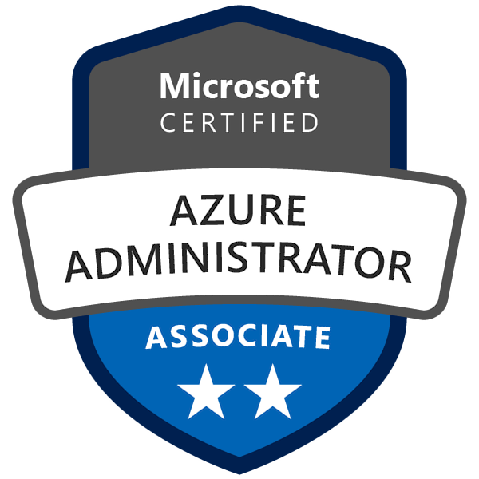
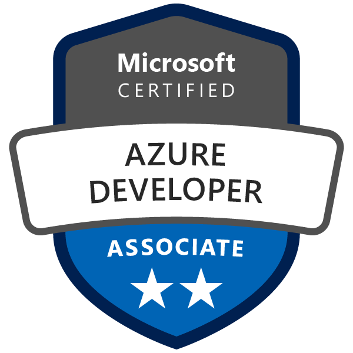
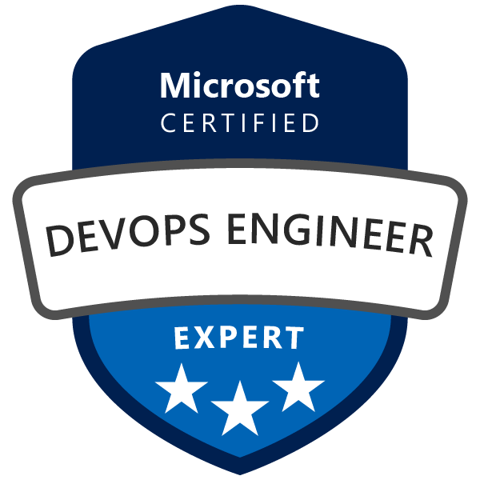

# Hey I'm Mateus...

I'm a DevOps Engineer and doggo enthusiast **based in Brazil South**

- 🏢 Building and improving cloud environments in [EBANX](https://www.ebanx.com/en/)
- 🔧 Love working with: AWS, Azure, Kubernetes, `.js`, `.py`, `.sh`, `.ps1`, `.tf`, `.json`, `.yaml` and containers, lots of containers
- 📖 Learning more and studying: Open Source, Terraform, and Cloud-Native Security.
- 💬 Ping me about: Cloud environments, mentorship, IT certifications and One Piece ⛵
- 😄 Interests: Infra as Code, Container orchestration, dogs and One Piece ⛵

#### Badges and IT certifications 🏆

  
  
  
  
  
  
  
  

#### Find me around the web 🌎
- 💼 Connecting and sharing professional updates on [Linkedin](https://www.linkedin.com/in/mateus-ralves/)
- 🎧 Listening to all my favorite jams on [Spotify](https://open.spotify.com/user/mateusfj?si=e11c80851f484d90) 

---
<figure>
  
  <figcaption>My two treasures 🐶🐶 </figcaption>
</figure>

